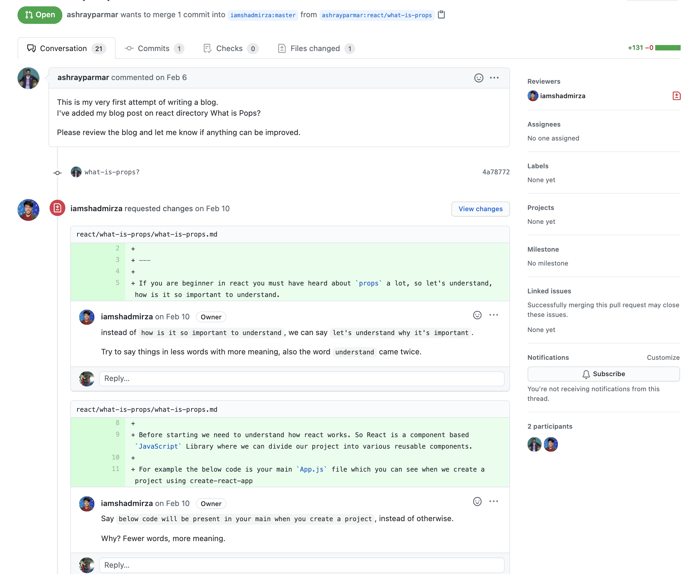

# Marketplace Listing Content Submission and Updates

[](https://app.soluble.cloud/repos/details/github.com/jefferyfry/marketplace-listing-content?orgId=604336610407)  
This repository contains the marketplace listing content for JFrog products. Git is used to track, manage and review the listing content changes. The listing content for [AWS](aws), [Azure](azure), [GCP](gcp) and [Red Hat](red-hat) are in their respective directories. Make updates to the listing content using the Git Fork and Pull Request workflow (see below).

# Requirements
* Install a Markdown editor: [MacDown](https://macdown.uranusjr.com/) for Mac, or [Ghostwriter](https://wereturtle.github.io/ghostwriter/) for Windows are options. Many others are available.
* [Install Git](https://git-scm.com/downloads)

# The Process
The following diagram illustrates the overall change process involving Product Marketing, SEO, Demand Gen and Cloud BD for making, reviewing, approving and publishing content changes.


1. A requestor (Product Marketing or Cloud BD) makes changes to the listing content markdown file and assets using the Git Fork and Pull Request Process as described below.
2. Through the PR review process, SEO, Demand Gen and Cloud BD review the changes and request updates if necessary.
3. When the listing content changes are accepted, Cloud BD uploads the content to the marketplace portal.
4. SEO, Demand Gen and Cloud BD review the marketplace listing draft or preview and request updates if necessary.
5. When the marketplace listing is approved, Cloud BD publishes the listing.

# Git Fork and Pull Request Process
Git provides a way to make changes to listing content, enable a multi-person review process and track changes.


1. The person making content changes (requestor) will fork this repository and clone the repository to their local system.

```
git clone
```

2. If the repository was previously forked and cloned, then it needs to be updated with the following command. This is called syncing a fork.

```
git fetch upstream
git checkout master
git merge upstream master
```

3. Proceed to make changes.

4. For each change, add the change and commit it with a message describing the change.

```
git add .
git commit -m 'Changes to the title of the GCP marketplace listing.
```
This will record that you made the changes and what was changed.

5. Push the changes to GitHub.

```
git push
```

5. Submit a pull request. This will request multiple reviewers to review and approve the changes. They may request updates. In that situation, repeat steps 3, 4 and 5.

[Example document review](https://github.com/iamshadmirza/TheNextBigWriter/pull/59):



6. When approved by the reviewers, the changes can be merged.
